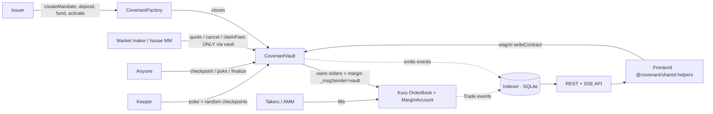

# Covenant

**Hire a market maker who can't dump your tokens — and only gets paid when the chain proves
they did the job.**

Covenant lets a token issuer hire a market maker (MM) on **Kuru** (Monad's fully on-chain order
book) under a mandate the MM *physically cannot break*. The issuer's tokens never touch the MM:
they sit in a **CovenantVault** contract that owns every Kuru order and the MarginAccount balance.
The MM can only quote *through* the vault, which enforces a net-sell cap, a price band and an
open-order cap **atomically in the same transaction** as each order — and the MM is paid a
retainer only for KPI intervals the chain proves it quoted two-sided, inside the band, at depth.

> Built for the Monad hackathon — **track: Onchain Finance & Trading**.

> **Live app:** https://covenant-sandy.vercel.app · **Hosted API:** https://covenantservices-production.up.railway.app/health
> (Monad testnet. No wallet needed to explore; one click funds a demo wallet to play issuer / MM / trader.)

> **AI coding disclosure:** this project was built with Claude Code (Anthropic). All contracts,
> services, tests, and docs were produced in AI-assisted sessions, per the hackathon's
> AI-disclosure rule. Pre-build validation lives in a clearly-labelled spike (see below).

## Architecture



**Layers:** `src/covenant/` contracts (Factory + Vault) → Kuru on Monad · `services/` keeper /
indexer / API / faucet / bots · `packages/shared/` typed action+read helpers, ABIs, addresses,
error decoder the frontend imports (see `docs/FRONTEND_INTEGRATION.md`).

## Pre-build validation (spike)

The Kuru integration was proven first in a spike (`src/KuruIntegrationSpike.sol`, `test/` root,
`TECHNICAL_SPIKE_REPORT.md`, `DAY_1_DECISION.md`, `docs/KURU_ARCHITECTURE.md`) — kept for the
"identify pre-existing code" rule. The product contracts are in `src/covenant/`.

## Tooling

```
forge --version   # forge 1.7.1 (commit 4072e487, 2026-05-08)
cast --version    # cast  1.7.1
solc              # 0.8.26 (via foundry.toml, evm_version = cancun)
```

## Networks (verified live in Phase 0)

| Network | chain id | RPC | Explorer |
|---|---|---|---|
| Monad testnet | 10143 (`0x279f`) | https://testnet-rpc.monad.xyz | https://testnet.monadexplorer.com |
| Monad mainnet | 143 (`0x8f`) | https://rpc.monad.xyz | https://monadvision.com |

## Env vars

Copy `.env.example` → `.env` and fill the private keys. `.env` is gitignored; never
commit secrets.

```
RPC_URL_TESTNET, RPC_URL_MAINNET
PRIVATE_KEY_DEPLOYER   # DEPLOYER/ISSUER 0xa34118bD1A2A789A962A4471C59c3964fb716123
PRIVATE_KEY_MM         # MM (operator)   0x687dFEcC7eAaFA4DC28f72Bfb9cdB77cAe18a641
PRIVATE_KEY_TAKER      # TAKER           0x7A0A94615094Ef0673f2D0F031D43fB9ED78cc0B
PRIVATE_KEY_ATTACKER   # ATTACKER        0x6d11172f538b60BE3a69c745944767Ac94019df7
```
All four wallets held 5 MON each on testnet as of 2026-09-23; testnet gas price ~102 gwei.

## Kuru testnet addresses (verified with `cast code`, Phase 1)

| Contract | Address |
|---|---|
| Router | `0x7EFbE105Ca7415dE98F96622173458ac1c054630` |
| MarginAccount | `0xd029C2D98ff85D8F64799017fE00a59B1159CE02` |
| KuruForwarder | `0x681bB1508E14433b148a2549ba2726454aDc9BB4` |
| MonadDeployer | `0xDacd06372cEb638640c9D8466A023b7362324e1A` |
| KuruUtils | `0xE0841E0F06c5770C1D4930EC6C507ee33199C88C` |
| Testnet USDC | `0x3bA3d39AFcf8bb994f7964B3e0171Ea2Ba361570` |
| MON/USDC market | `0xa241896A7Dbe8a550D2E5fF7A914bB1989ceD2D9` |

## Commands

```bash
forge build
forge test -vvv                                    # local + mock unit tests
forge test --fork-url $RPC_URL_TESTNET -vvv        # fork tests against real Kuru
# Phase 9 real testnet broadcast (spends MON):
forge script script/<Script>.s.sol --rpc-url $RPC_URL_TESTNET --broadcast
```

## Layout

```
src/interfaces/   IKuruOrderBook / IKuruMarginAccount / IKuruRouter (OBSERVED signatures)
src/mocks/        MockBase (18dec) / MockUSDC (6dec) — NEVER mixed with real Kuru ifaces
src/              KuruIntegrationSpike.sol — the contract-owned vault under test
test/             lifecycle / order-id / fills / governor / band / adversarial / gas
docs/             KURU_ARCHITECTURE.md
```

---

## Off-chain services (Day 3)

A pnpm workspace sits alongside the Foundry project:
- `packages/shared` — ABIs, testnet addresses, viem chain config, TS types, and the custom-error decoder the frontend imports.
- `services` — ONE Node process (viem) with modules: indexer (SQLite, chunked getLogs), api (REST + SSE), keeper (poke / random checkpoints / finalize), faucet (+ demo sessions), and bots (seeder / MM honest+malicious / taker).

```bash
pnpm install
pnpm demo:setup      # deploy a fresh demo mandate (short windows) + refresh shared addresses
pnpm dev:services    # indexer + API (add RUN_KEEPER=true RUN_MM_BOT=true RUN_TAKER_BOT=true for the full demo)
pnpm test:services   # vitest unit tests
```
New env vars (see .env.example): PRIVATE_KEY_KEEPER/FAUCET/SEEDER, DB_PATH, PORT, module toggles.
Details + live soak results: SERVICES_REPORT.md. Overall status + roadmap: PROGRESS.md.

## Why Monad
Covenant needs a fully on-chain order book so a contract can OWN maker orders and the chain can
PROVE the MM's work — Monad + Kuru provide exactly that (CLOB in EVM bytecode, no off-chain
matching). Monad's high throughput and sub-second blocks make per-move requoting and frequent
permissionless checkpoints economical, and its gas-on-limit model is accounted for throughout
(every tx sets estimate x 1.15). The design is impossible on an AMM-only or off-chain-matched venue.

## Live app + hosted API + deployed addresses (Monad testnet, chain 10143)

- **Live app:** https://covenant-sandy.vercel.app
- **Hosted backend:** https://covenantservices-production.up.railway.app — `/health`, `/config`,
  `/markets`, `/mandates/:vault`, `/mandates/:vault/summary`, `/proof/:vault`, `/stream/:vault` (SSE).

Current on-chain addresses (what the live app uses):

| Contract | Address | Verified |
|---|---|---|
| **CovenantFactory** | `0x49dcD18CdACB881070Afb90f0b992ad7afac34E4` | Sourcify exact_match ([lookup](https://sourcify.dev/#/lookup/0x49dcD18CdACB881070Afb90f0b992ad7afac34E4)) |
| **CovenantVault implementation** (every mandate is an EIP-1167 clone of this) | `0x987922C61bD2941D593ED145A4D894f62838b18d` | Sourcify exact_match ([lookup](https://sourcify.dev/#/lookup/0x987922C61bD2941D593ED145A4D894f62838b18d)) |
| **Flagship mandate** (reference vault, ACTIVE) | `0x27199bf4D9b8B2c4bD509e642ea7Be9C58f85408` | clone of impl above |
| **Flagship Kuru market** | `0x1429116A9795FC921bb3Bc735a656B55804714c6` | — |
| **House market maker** | `0x687dFEcC7eAaFA4DC28f72Bfb9cdB77cAe18a641` | — |
| **Demo base token** (MockBase, 18dec) | `0xC5652d30758EaF1e0ABA2Fa46e3fB069d6f33617` | — |
| **Demo quote token** (MockUSDC, 6dec) | `0x2968F6Ab34415bBF6D8cB72e25c3578B5796A60c` | — |
| Kuru Router / MarginAccount | `0x7EFbE105Ca7415dE98F96622173458ac1c054630` / `0xd029C2D98ff85D8F64799017fE00a59B1159CE02` | Kuru-deployed |

(The demo uses MockBase/MockUSDC so anyone can mint test tokens; mainnet would use real USDC. The
`## Kuru testnet addresses` and env-var wallets above are Phase 0/1 contract-dev provenance.)

Live proofs: `docs/E2E_RUN.md` (full lifecycle → SETTLED with exact balances), `docs/SOAK_REPORT.md`
(hosted soak), `CONTRACTS_REPORT.md` (97 tests + 4 invariants). Frontend wiring guide:
`docs/FRONTEND_INTEGRATION.md`.

## Bounties

Primary track **Onchain Finance & Trading**. Targeting two Kuru sponsor bounties — lead:
**"Bring New Assets and Markets to Kuru"** (Covenant is the liquidity + settlement infrastructure
that makes a new token's Kuru market viable); secondary: **"Build the Next Consumer Trading App on
Kuru"** (routes real trades through Kuru's order book). Details + judging-criteria mapping in
`docs/BOUNTIES.md`.
