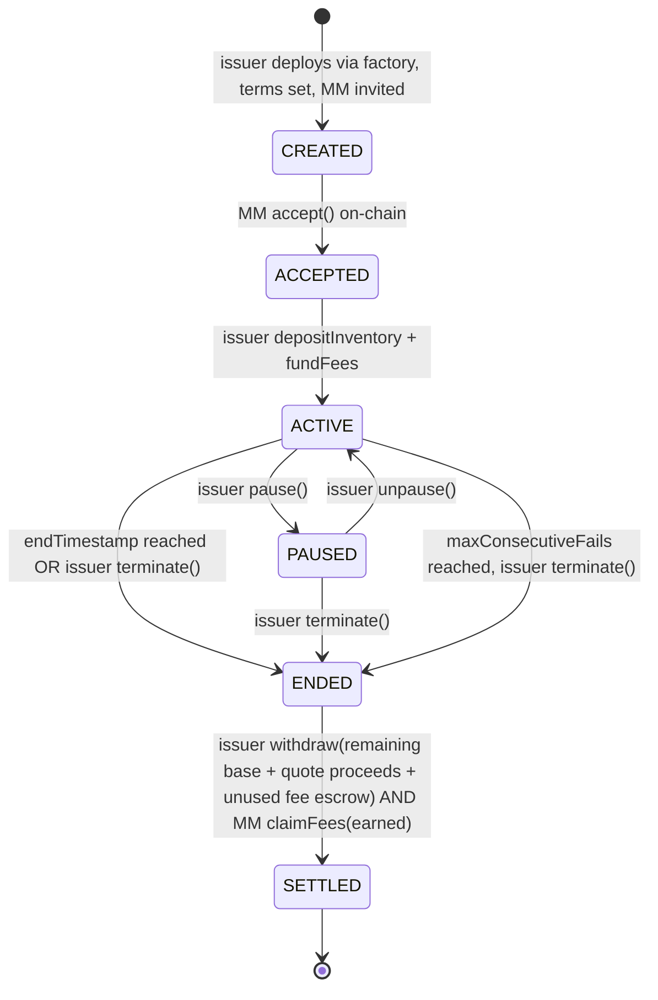
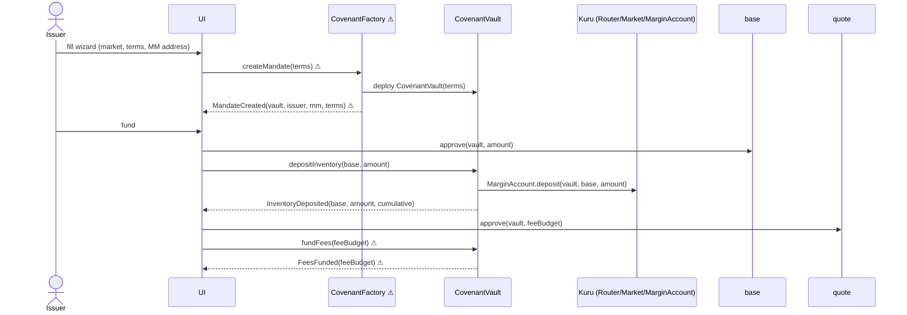
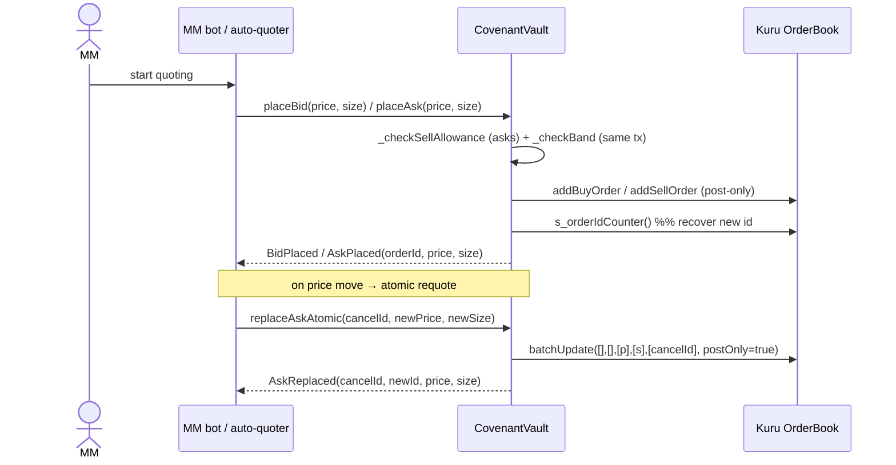
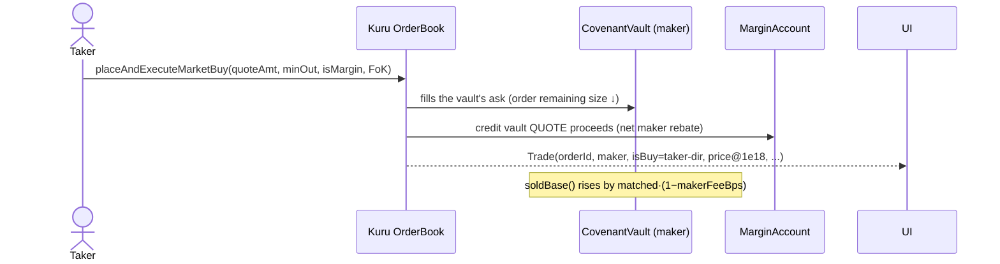
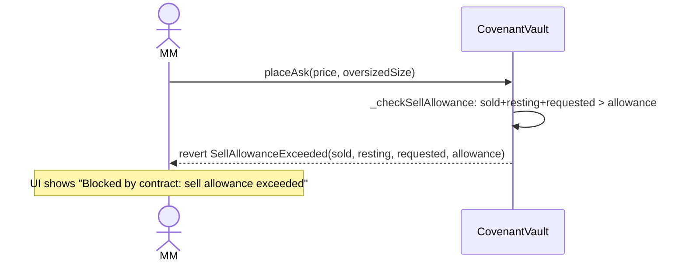
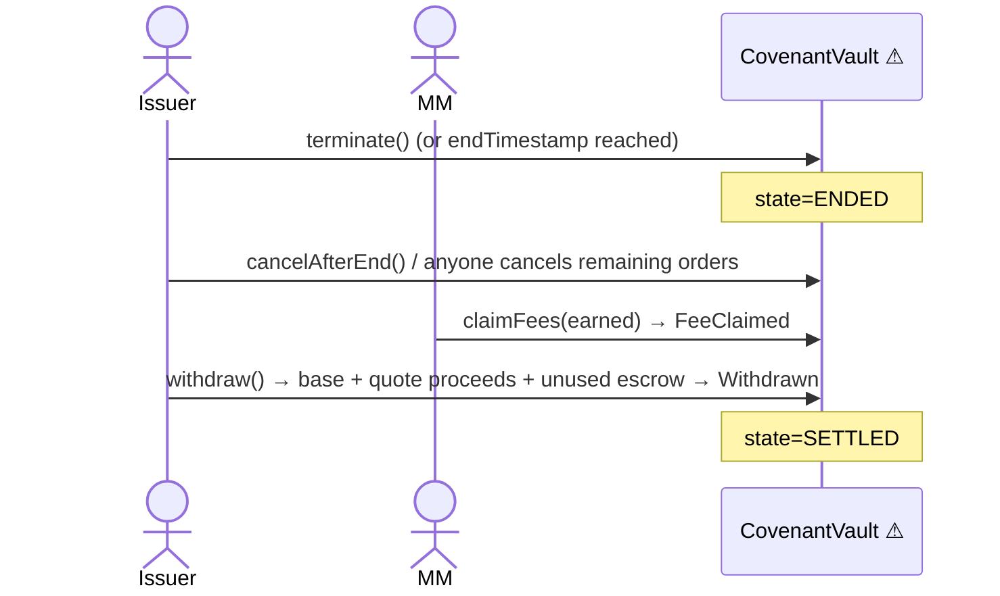
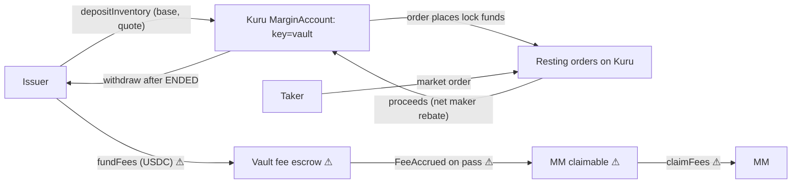

# Covenant — Product Flow (single source of truth)

> Scope of truth: this document describes the **product**. Where a claim is backed by the
> technical spike in this repo (`TECHNICAL_SPIKE_REPORT.md`, `DAY_1_DECISION.md`,
> `docs/KURU_ARCHITECTURE.md`, `src/KuruIntegrationSpike.sol`, `test/`), it is stated plainly.
> Where the product needs something the spike did **not** prove, it is tagged inline
> **`⚠ UNPROVEN:`** with what is missing. Nothing here should be read as "already built" unless
> it maps to a passing test or a recorded testnet tx in the spike report.

> **Changelog**
> - 2026-09-24: **accept() now pins the terms hash** — `accept(bytes32 termsHash)` reverts
>   `TermsMismatch` unless it equals `keccak256(abi.encode(terms))`; any issuer edit in CREATED
>   changes the hash, so a stale (or same-block front-run) acceptance can never bind the MM to
>   unseen terms. **AMM-vault fills against the vault's orders are ALLOWED** — Kuru's
>   `bestBidAsk` (and matching) include the AMM vault's liquidity; the vault's band references
>   that AMM-inclusive mid, and takers/AMM filling the vault's orders is fair (the vault is paid
>   at its own posted price and the volume counts against the net-sell cap). Quote token == fee
>   token (MockUSDC on testnet; Monad-native USDC on mainnet — not built here).
> - 2026-09-24: **Checkpoint redesigned to FAIL-DOMINANT** (see §Checkpoint design below) and
>   BUILT — `CovenantFactory` + `CovenantVault` implemented in `src/covenant/`, 60 tests +
>   4 invariants pass on a Monad-testnet fork, deployed live (see `CONTRACTS_REPORT.md`). Many
>   `⚠ UNPROVEN` items from the Day-1 version are now PROVEN; the report is authoritative.

### Checkpoint design (fail-dominant — supersedes the earlier "pays if observed passing" text)

`checkpoint()` is permissionless and may be called any number of times per interval. Each call
*observes* the vault's current quoting vs the live mid and records a pass **or** a fail for the
current interval. **An interval PAYS its fee only if it was observed AND had a passing
observation AND had NO failing observation** — any single failing observation permanently voids
the fee (fail-dominant). Intervals are finalized lazily when a later interval is observed (or via
`finalize()` after ENDED); unobserved intervals pay nothing and are neutral for the
consecutive-fail counter; paused intervals get no observations (checkpoint reverts while paused)
so they are neither paid nor failed. Events: `CheckpointObserved(interval, passed, spreadBps,
bidDepth, askDepth, mid)` and `IntervalFinalized(interval, paid, amount)` — these replace the
earlier `CheckpointPassed`/`CheckpointFailed`.

---

## 1. TL;DR

- Covenant lets a token **issuer** hire a **market maker (MM)** on **Kuru** (Monad's on-chain
  order book) under a mandate the MM **physically cannot break**.
- The issuer's tokens never touch the MM. They live in a **CovenantVault** contract that
  **owns every Kuru order and the MarginAccount balance**; the MM can only place/cancel orders
  *through* the vault, and the vault checks the mandate **in the same transaction** as each order.
- The MM is paid a **retainer fee per checkpoint**, and only **when the chain proves** it quoted
  two-sided, inside the band, at the required depth. Fail a checkpoint → no fee for that period.
- Proven by the spike: a contract can own Kuru orders/margin (no EOA/EIP-7702), recover order
  ids on-chain, measure its own net-sold amount on-chain, and enforce a sell cap + price band
  atomically; the MM cannot withdraw inventory. Live on Monad testnet.
- Honest limit: Covenant governs **on-chain inventory on Kuru**. It cannot stop an MM hedging
  elsewhere (e.g. shorting perps). It protects the **issuer's tokens** and **proves the MM's work**.

---

## 2. The problem, for a newcomer

**Market making** is the business of continuously quoting both a **buy price (bid)** and a
**sell price (ask)** for a token so other people can always trade. The MM profits from the
**spread** (the gap between bid and ask) and is judged on **depth** (how much size rests on each
side) and **uptime** (how continuously it quotes).

Token projects need their token to be tradeable from day one, so they hire MMs. The **classic
deal** is a **token loan + call option**: the project *lends* the MM a pile of tokens for free,
and grants the MM a **call option** to buy those tokens later at a fixed **strike price**. The
MM sells the borrowed tokens into retail demand and uses the option to cap its risk
(**delta hedging** = trading to stay market-neutral). Terms are secret. Incentives are
misaligned: the MM can quietly **dump** the loaned inventory.

**Movement Labs** is the cautionary tale: ~66M tokens hit the market the day after listing,
triggering investigations, a buyback, and later Chapter 11.

Today's "fixes" don't enforce anything on-chain:
- **Coinwatch** watches MMs via API keys — monitoring, not enforcement.
- **Blockworks' transparency framework** and **Binance's disclosure rules** are self-reported paperwork.
- **Arrakis** replaces the active MM with a passive vault — it doesn't discipline an active MM.

The industry is shifting to the **retainer / performance-fee** model: the issuer **keeps** its
inventory, **pays the MM a fee**, and judges it on spread + uptime (Bullish publicly favors
performance-based fees). That model needs two things nobody provides on-chain:
1. inventory the MM can **use but not take**, and
2. **KPI proof** nobody can fake.

**Covenant is exactly those two things.**

### Glossary

| Term | Plain meaning |
|---|---|
| **Market maker (MM)** | A firm/bot that continuously posts buy and sell orders so others can trade. |
| **Spread** | Ask price − bid price. Tighter = healthier market. Measured in **bps** (1 bps = 0.01%). |
| **Depth** | How much size is resting at/near the top of the book on each side. |
| **Order book** | The live list of resting bids and asks. Kuru is a fully on-chain order book (CLOB). |
| **Maker / taker** | *Maker* posts a resting limit order; *taker* crosses the spread and fills it. |
| **Token loan** | Project lends tokens to the MM to quote with. |
| **Call option** | Right (not obligation) to buy tokens later at a fixed **strike** price. |
| **Delta hedging** | Trading to stay price-neutral (offset directional exposure). |
| **Retainer** | A flat/performance fee the issuer pays the MM to quote — inventory stays with the issuer. |
| **Band** | Allowed price range for the MM's orders, ±X% around the mid. |
| **Mid price** | (best bid + best ask) / 2 — the fair reference price. |
| **Checkpoint** | A periodic on-chain scoring of the MM's KPIs; pass = fee accrues, fail = no fee. |
| **KPI** | Key performance indicator: two-sided presence, max spread, min depth. |
| **Net sell cap** | Max **net** base the MM may sell per window (buybacks via the vault's bids offset sells). |

---

## 3. The solution and the one mechanism

Covenant is a per-mandate **CovenantVault** smart contract that:

1. **Custodies inventory** in *its own* Kuru **MarginAccount** balance
   (`balances[keccak256(vault, token)]`). — proven: `LifecycleTest.test_depositCreditsVaultMargin`.
2. **Owns every Kuru order** it places, because Kuru keys order ownership to ERC2771
   `_msgSender()` and a direct contract call makes the *contract* the owner (no `tx.origin`/EOA
   guard). — proven: `LifecycleTest.test_ownership_mmOwnsNothing`, source `OrderBook.sol:377`.
3. **Gates the MM**: place/replace/cancel are `onlyMM` functions on the vault; the MM has no
   other way to touch the inventory. The MM cannot withdraw (`MarginAccount.withdraw` is
   self-keyed) and cannot cancel the vault's orders directly (owner-checked). — proven:
   `AdversarialTest` (11 tests).
4. **Enforces the mandate atomically**: every order placement runs the sell-cap governor and the
   price-band check **in the same transaction**, reading the live mid from Kuru's `bestBidAsk`.
   — proven: `GovernorTest`, `BandTest`.
5. **Pays for provable work only**: a permissionless `checkpoint()` scores KPIs from on-chain
   state and accrues the fee only if the MM passed. **⚠ UNPROVEN:** checkpoint scoring + fee
   accrual are product additions not in the spike contract.

**The one mechanism, in one sentence:** *the tokens sit in a contract that is the only thing
allowed to place Kuru orders, and it refuses any order that breaks the mandate — so the MM works
inside rails it cannot bend.*

---

## 4. Users and their jobs-to-be-done

| User | Who | Jobs-to-be-done |
|---|---|---|
| **Issuer** | Token team | Create a mandate with terms; deposit inventory + fee budget; watch live compliance; pause / terminate / withdraw. |
| **Market maker** | Trading firm or bot operator | Review + accept a mandate; quote through the vault (bot/SDK, or the demo auto-quoter); pass checkpoints; claim earned fees. |
| **Public** | Retail traders, exchanges, investors | Verify terms + live compliance **with no wallet**; trade against the book. |

---

## 5. Mandate terms reference

Set by the issuer at creation. **Intended immutable once the MM accepts** (see Open Decisions #1
— the spike's `setMandate` is issuer-mutable, which is demo-only).

| Field | Meaning | Default | Who sets | Enforced where |
|---|---|---|---|---|
| `base`, `quote`, `market` | Base token, quote (USDC), Kuru market address | — | Issuer | Vault constructor checks `getMarketParams` (proven: `MarketAssetMismatch`). |
| `issuer`, `mm` | Party addresses; MM is invited | — | Issuer | Role modifiers `onlyIssuer` / `onlyMM` (proven). |
| `baseInventory` | Base deposited | — | Issuer | `depositInventory` (proven). |
| `quoteInventory` | Optional quote for bids | 0 | Issuer | `depositInventory` (proven for quote too). |
| `netSellCapPerWindow` | Max **net** base sold per window | 1,000 base | Issuer | Governor `_checkSellAllowance`. Spike enforces a **cumulative** cap (proven). **⚠ UNPROVEN:** windowed reset + bid-buyback netting. |
| `windowSeconds` | Sell-cap window | 86,400 (24h) | Issuer | **⚠ UNPROVEN:** no time window in the spike. |
| `bandBps` | Max ± distance of any vault order from mid | 200 (±2%) | Issuer | `_checkBand` vs `bestBidAsk` mid, same tx (proven, incl. AMM-vault liquidity). |
| `maxOpenOrdersPerSide` | Cap on simultaneous resting orders per side | 5 | Issuer | **⚠ UNPROVEN:** spike measured O(N) gas but does not enforce a cap. |
| `maxSpreadBps` (KPI) | Max spread between the vault's own best bid & ask | 100 (±1%) | Issuer | **⚠ UNPROVEN:** checkpoint. |
| `minDepth` (KPI) | Min resting size per side | e.g. 100 base | Issuer | **⚠ UNPROVEN:** checkpoint. |
| `checkpointInterval` | Time between paid checkpoints | 1h prod / 60–120s demo | Issuer | **⚠ UNPROVEN:** checkpoint. |
| `feePerCheckpoint` | USDC paid per passing checkpoint | 50 USDC | Issuer | **⚠ UNPROVEN:** fee escrow/accrual. |
| `endTimestamp` | Mandate duration | +30 days | Issuer | **⚠ UNPROVEN:** lifecycle/ENDED. |
| `maxConsecutiveFails` | Fails before issuer may terminate early | 3 | Issuer | **⚠ UNPROVEN:** checkpoint counter. |

**Net sell cap, explained.** "Net" means base **bought back** through the vault's bids offsets
base **sold** through its asks. The spike's on-chain measure is:

```
soldBase = baseDepositedCumulative − getBalance(vault, base) − Σ(remaining ask size · 10^baseDec / sizePrecision)
```

When a bid fills, bought base lands in the vault's free margin, which **reduces** `soldBase`
automatically — so the formula is inherently *net-ish* on a two-sided book, and clamps at 0.
It is exact to integer rounding; it differs from *gross* matched base only by the maker rebate
(`makerFeeBps`, ≤0.1% of matched). — proven one-sided: `FillsTest` (7 tests) + `Diag.t.sol`.
**⚠ UNPROVEN:** the netting interaction when the vault's **bids also fill** (buybacks) and the
**per-window reset** were not tested; the spike uses a single cumulative cap.

---

## 6. Lifecycle state machine

**⚠ UNPROVEN:** the entire multi-state lifecycle below (CREATED/ACCEPTED/ACTIVE/PAUSED/ENDED/
SETTLED, pause, terminate, checkpoint-driven early termination) is a product addition. The spike
implements only a single always-active vault with `onlyIssuer` withdraw and no state field.



**Rules.** Failed checkpoints pay nothing (the fee "freezes"). After `maxConsecutiveFails`
consecutive fails, the issuer may `terminate()` early. **The MM never has a withdraw path for
inventory or proceeds — only for earned fees.** (Inventory-withdraw-blocking is proven; the
fee-claim path is `⚠ UNPROVEN`.)

### Allowed actions per state per role

| State | Issuer | MM | Anyone |
|---|---|---|---|
| CREATED | (invite MM) | `accept` | `terms()`, `state()` views |
| ACCEPTED | `depositInventory`, `fundFees` | — | views |
| ACTIVE | `pause`, `terminate`, `fundFees` | `quote`/`replace`/`cancel`, `claimFees` | `checkpoint`, views, trade on book |
| PAUSED | `unpause`, `terminate` | `cancel` only (no new orders) | `checkpoint` (fails while paused?), views |
| ENDED | `withdraw` (after all cancelled) | `claimFees`, `cancel` | `cancelAfterEnd`, views |
| SETTLED | — | — | views (historical) |

**⚠ UNPROVEN:** all rows except the ACTIVE cell's quote/replace/cancel + inventory-withdraw
blocking, which the spike proves.

---

## 7. End-to-end journeys

### 7a. Issuer creates & funds a mandate



### 7b. MM quote flow (place / atomic replace)



### 7c. Taker fill (any visitor trades)



### 7d. Checkpoint (permissionless scoring) ⚠ UNPROVEN

```mermaid
sequenceDiagram
    actor Anyone as Keeper / anyone
    participant Vault as CovenantVault ⚠
    participant Kuru as Kuru (s_orders, bestBidAsk)
    Anyone->>Vault: checkpoint()
    Vault->>Kuru: read vault best bid & ask, sizes, mid
    Vault->>Vault: score KPIs (two-sided? spread≤max? depth≥min?)
    alt pass and interval elapsed
        Vault-->>Anyone: CheckpointPassed(t, metrics); FeeAccrued(amount)
    else fail
        Vault-->>Anyone: CheckpointFailed(t, reason)
    end
```

### 7e. Blocked sell (the wow moment)



### 7f. Settlement ⚠ UNPROVEN



---

## 8. Screen-by-screen spec

Conventions: wallet via **wagmi + RainbowKit**; every write shows **estimate gas + small buffer**
(Monad charges the **limit**, proven). Every screen has **loading** (skeletons), **empty**, and
**error** (decoded revert) states. "Reads" are contract `view` calls or indexer queries.

### 8.1 Landing `/`

```
+--------------------------------------------------------------+
|  COVENANT                                   [Launch app]     |
|  Hire a market maker who can't dump your tokens —            |
|  and only gets paid when the chain proves they did the job.  |
|                                                              |
|  [ The Movement story: 66M tokens dumped day 1. Never again.]|
|                                                              |
|  How it works:  1) Deposit  2) MM quotes in rails  3) Pay on |
|                    inventory     it can't break     proof    |
|  [Launch app]        [View a live mandate →]                 |
+--------------------------------------------------------------+
```
- Purpose: explain the product in 10 seconds; two CTAs.
- Actions: **Launch app** → `/app`. **View a live mandate** → `/proof/[demoId]` (no wallet).
- No contract calls.

### 8.2 Get started / faucet `/start`

```
+---------------------------------------------+
| Connect wallet   [RainbowKit]               |
|            — or —                           |
| [ Try demo mode ] (creates a burner wallet) |
| [ Get demo tokens ]  base + USDC + a little MON |
+---------------------------------------------+
```
- **Connect wallet** → wagmi connect. **Try demo mode** → generate in-browser burner, call
  **Faucet API** (off-chain) to drip MON + mint mock base/USDC. **Get demo tokens** → Faucet API
  `mint` (testnet MockBase/MockUSDC `mint`, proven ERC20s) + MON drip.
- States: faucet rate-limited → "try again in N s".

### 8.3 Issuer home `/app`

```
+-----------------------------------------------------------+
| My mandates                              [+ Create mandate]|
|-----------------------------------------------------------|
| MEME/USDC   ACTIVE   net-sold 320/1000  fee 4×50 USDC  ●●●○|
| TESTA/USDC  ENDED    withdraw available                    |
+-----------------------------------------------------------+
```
- Purpose: list my mandates with state badge + live stats.
- Reads: `Factory.mandatesByIssuer(me)` ⚠ → per vault `state()` ⚠, `soldInWindow()`
  (spike `soldBase()` proven), `remainingAllowance()`, `accruedFees()` ⚠, `lastCheckpoint()` ⚠.
- Action: **Create mandate** → `/create`.

### 8.4 Create mandate wizard `/create`

```
Step 1 Market   [ pick existing ▼ ] or [ Create Kuru test market ]  (Router.deployProxy, proven testnet)
Step 2 Terms    net cap [====|----] 1000/24h   band [==|----] ±2%
                fee/checkpoint [50 USDC]  interval [1h]  depth [100]
                Preview: "Your MM may net-sell at most 1,000 TOKEN per 24h,
                must quote within ±2% of mid, and earns 50 USDC per passing checkpoint."
Step 3 Invite   MM address [0x...]  → invite link  /invite/[id]
Step 4 Fund     [approve base][depositInventory]  [approve USDC][fundFees]
```
- Step 1 action: **Create Kuru test market** → `Router.deployProxy(...)` (proven on testnet;
  mainnet is owner-gated → use a Kuru-provisioned market). Emits Kuru market creation.
- Step 2: sliders update a plain-English preview; no tx.
- Step 3 action: **Create** → `Factory.createMandate(terms)` ⚠ → `MandateCreated` ⚠; generate
  `/invite/[id]`.
- Step 4 actions: `base.approve(vault, amt)` → `depositInventory(base, amt)` → `InventoryDeposited`
  (proven); `USDC.approve(vault, budget)` → `fundFees(budget)` ⚠ → `FeesFunded` ⚠.
- States: not-enough-balance → disable + link to faucet; approve pending → spinner on the button.

### 8.5 Mandate dashboard `/mandate/[id]` (issuer HERO screen)

```
+----------------------------------------------------------------------+
| MEME/USDC   ACTIVE                         [Pause] [Terminate] [Withdraw]
|----------------------------------------------------------------------|
| Issuer → [Vault] → Kuru book → Takers      (animated on real events)  |
|                 ↘ USDC proceeds ↙   ↘ fees → MM                       |
|----------------------------------------------------------------------|
| ORDER BOOK (vault orders ★, band shaded)   | NET ALLOWANCE            |
|   asks  2.04 ★  2.03      | 2.06           | [######----] 320/1000    |
|   -------- mid 2.02 ----- band ±2% -----   | KPI TIMELINE             |
|   bids  2.00 ★  1.99      | 1.97           | ●●●○●   (green/red)      |
|                                            | FEE  4×50 = 200 (▲ live) |
|----------------------------------------------------------------------|
| Activity: AskPlaced #12 · Trade 40 · CheckpointPassed · [explorer↗]   |
+----------------------------------------------------------------------+
```
- Reads (live): `terms()`, `state()` ⚠, `restingOrders()` (spike tracks `openAskIds`/`openBidIds`
  + `s_orders`), `bestBidAsk()` for mid+band, `soldInWindow()` (spike `soldBase()`),
  `remainingAllowance()`, `lastCheckpoint()` ⚠, `accruedFees()` ⚠; activity feed from the indexer.
- Flow strip animates **only on real events** (OrderPlaced/Trade/CheckpointPassed/FeeAccrued).
- Actions: **Pause** → `pause()` ⚠ → `Paused`; **Terminate** → `terminate()` ⚠ → `Terminated`;
  **Withdraw** (only after ENDED) → `withdraw()` ⚠ → `Withdrawn` (spike proves `withdrawInventory`
  of free margin only).
- States: paused banner; ended banner with withdraw CTA; error card on any revert.

### 8.6 MM invite `/invite/[id]`

```
+-----------------------------------------------+
| You're invited to market-make MEME/USDC       |
| Rails you must stay inside:                    |
|  • net-sell ≤ 1000/24h  • ±2% band  • ≤5 orders/side |
| You earn 50 USDC per passing checkpoint (1h).  |
| Risks: fees freeze on failed checkpoints; you  |
| cannot withdraw inventory, only earned fees.   |
|                         [ Accept mandate ]     |
+-----------------------------------------------+
```
- Reads: `terms()`, `state()` ⚠. Action: **Accept mandate** → `accept()` ⚠ → `MandateAccepted`;
  redirect to `/mm/[id]`.

### 8.7 MM console `/mm/[id]`

```
+----------------------------------------------------------------------+
| Manual quote:  side [ask▼] price [2.04] size [100]  [Place] [Replace] |
| Auto-quote: [ ON ]  requote on ±0.2% move or every 5s                 |
|----------------------------------------------------------------------|
| PREFLIGHT  ● OK / ● RED "sell allowance exceeded"     [Send anyway]   |
| KPI: two-sided ✓  spread 0.8% ✓  depth 120 ✓   Earned 200 · Claim 200 |
+----------------------------------------------------------------------+
```
- Preflight = local re-computation of governor+band+order-cap against live views
  (`soldBase`, `restingAskBaseRaw`, `bestBidAsk`); turns red before the user pays.
- Actions:
  - **Place** → `placeAsk`/`placeBid` (proven) → `AskPlaced`/`BidPlaced`.
  - **Replace** → `replaceAskAtomic` (proven) → `AskReplaced`.
  - **Send anyway** → sends the tx even when preflight is red; if it reverts, show the decoded
    error (see 8.7 error card).
  - **Auto-quote ON** → in-browser loop calling place/replace on price moves (NOT every block;
    see §12).
  - **Claim** → `claimFees()` ⚠ → `FeeClaimed`.
- Error card (on revert): big "**Blocked by contract**" panel, decoded error
  (`SellAllowanceExceeded(sold, resting, requested, allowance)` → "You'd net-sell 1,040 > 1,000
  allowed"), explorer link.
- States: auto-quote paused when state≠ACTIVE; claim disabled when accruedFees=0.

### 8.8 Public proof page `/proof/[id]` (no wallet)

```
+-----------------------------------------------+
| ✔ Enforced by Covenant — MEME/USDC            |
| Terms (live from contract):                   |
|   net cap 1000/24h · band ±2% · fee 50/1h     |
| Compliance: 42/45 checkpoints passed          |
| Net sold this window: 320 / 1000  [verify ↗]  |
| [ Embed this badge ]   [ Trade → ]            |
+-----------------------------------------------+
```
- Reads only (no wallet): `terms()`, `soldInWindow()`, checkpoint history (indexer),
  `remainingAllowance()`. Every number has a "verify on explorer" link (the read tx / event).
- Actions: **Embed badge** → copies an iframe snippet; **Trade** → `/trade/[market]`.

### 8.9 Trade panel `/trade/[market]` (or embedded on proof)

```
+-------------------------------+
| Buy / Sell MEME               |
| amount [___]  [Buy] [Sell]    |
| you receive ~ ... (est)       |
+-------------------------------+
```
- Actions: **Buy** → `market.placeAndExecuteMarketBuy(quoteAmt, minOut, isMargin=false, FoK)`
  (proven); **Sell** → `placeAndExecuteMarketSell(...)`. Fills move the dashboard gauge in real time.
- Note: `_quoteAmount` is in **price-precision units** (proven correction) — the UI converts.

---

## 9. Contract interface spec

**Proven today** (spike `KuruIntegrationSpike.sol`): `depositInventory`, `withdrawInventory`
(issuer-only, free margin), `placeAsk`, `placeBid`, `cancelOrder`, `replaceAskAtomic`, `getOrder`,
`restingAskBaseRaw`, `soldBase`, `openAskCount`/`openBidCount`, `priceMid`, `setMandate`
(demo-only), roles `issuer`/`mm`. Errors: `NotIssuer`, `NotMM`, `SellAllowanceExceeded`,
`PriceOutOfBand`, `EmptyBook`, `MarketAssetMismatch`. Events: `InventoryDeposited`,
`InventoryWithdrawn`, `AskPlaced`, `BidPlaced`, `OrderCancelled`, `AskReplaced`, `MandateUpdated`.

**Product target** (rename/extend; everything marked ⚠ is UNPROVEN):

### CovenantFactory ⚠
| Function | Role | Effect | Event |
|---|---|---|---|
| `createMandate(Terms)` | anyone (issuer) | deploy a CovenantVault | `MandateCreated(vault, issuer, mm, termsHash)` |
| `mandatesByIssuer(addr)` / `mandatesByMM(addr)` | view | registry for the app | — |

### CovenantVault
| Function | Role | Effect | Event | Status |
|---|---|---|---|---|
| `accept()` | MM | CREATED→ACCEPTED | `MandateAccepted` | ⚠ |
| `depositInventory(token, amt)` | issuer | fund own margin | `InventoryDeposited` | proven |
| `fundFees(amt)` | issuer | escrow USDC fees | `FeesFunded` | ⚠ |
| `quote(bids[], asks[], cancelIds[])` | MM | governed batchUpdate (place/replace) | `OrderPlaced`/`OrderReplaced` | partial (spike: single place/replace proven) |
| `cancel(id)` | MM | cancel own order | `OrderCancelled` | proven |
| `checkpoint()` | anyone | score KPIs; accrue fee once/interval | `CheckpointPassed`/`CheckpointFailed`/`FeeAccrued` | ⚠ |
| `claimFees()` | MM | pull earned fees | `FeeClaimed` | ⚠ |
| `pause()`/`unpause()` | issuer | block/allow quoting | `Paused`/`Unpaused` | ⚠ |
| `terminate()` | issuer | →ENDED | `Terminated` | ⚠ |
| `cancelAfterEnd()` | anyone | cancel leftover orders | `OrderCancelled` | ⚠ |
| `withdraw()` | issuer | base + quote proceeds + unused escrow → issuer | `Withdrawn` | partial (spike: free-margin withdraw proven) |
| **views** | anyone | `terms()`, `state()`⚠, `soldInWindow()`, `remainingAllowance()`, `restingOrders()`, `lastCheckpoint()`⚠, `accruedFees()`⚠ | — | mixed |

### Events (fields)
- `MandateCreated(address vault, address issuer, address mm, bytes32 termsHash, address market)` ⚠
- `MandateAccepted(address mm, uint256 ts)` ⚠
- `InventoryDeposited(address indexed token, uint256 rawAmount, uint256 cumulative)` ✔
- `FeesFunded(uint256 amount, uint256 escrowTotal)` ⚠
- `OrderPlaced(uint40 indexed id, bool isBid, uint32 price, uint96 size)` (spike: `AskPlaced`/`BidPlaced`) ✔
- `OrderCancelled(uint40 indexed id)` ✔ · `OrderReplaced(uint40 indexed oldId, uint40 indexed newId, uint32 price, uint96 size)` ✔ (`AskReplaced`)
- `CheckpointPassed(uint256 ts, uint16 spreadBps, uint96 depthBid, uint96 depthAsk)` ⚠
- `CheckpointFailed(uint256 ts, uint8 reasonCode)` ⚠
- `FeeAccrued(uint256 amount, uint256 accruedTotal)` ⚠ · `FeeClaimed(uint256 amount)` ⚠
- `Paused(uint256 ts)` / `Unpaused(uint256 ts)` / `Terminated(uint256 ts, uint8 reason)` ⚠
- `Withdrawn(address indexed token, uint256 amount)` ✔ (`InventoryWithdrawn`)

### Custom errors → UI messages
| Error | UI message | Status |
|---|---|---|
| `SellAllowanceExceeded(sold, resting, requested, allowance)` | "Blocked: you'd net-sell {sold+resting+requested} > {allowance} allowed this window." | proven |
| `PriceOutOfBand(price, lo, hi)` → product `OutsideBand(price, mid, bandBps)` | "Blocked: price {price} is outside the ±{bandBps} band around mid {mid}." | proven (as PriceOutOfBand) |
| `EmptyBook()` | "No reference price yet — the other side of the book is empty." | proven |
| `TooManyOpenOrders(cap)` | "Blocked: you already have {cap} orders resting on this side." | ⚠ |
| `NotMM()` / `NotIssuer()` | "Only the {role} can do this." | proven |
| `WrongState(expected, actual)` | "This action isn't allowed while the mandate is {actual}." | ⚠ |

---

## 10. Off-chain components

| Component | Reads | Writes | Notes |
|---|---|---|---|
| **Keeper** | vault `state()`, `checkpointInterval` | `checkpoint()` each interval | Permissionless — anyone can also call it, which is the anti-gaming property (§13). ⚠ |
| **Indexer** | `getLogs` for all events | small DB (history, charts, activity feed) | Frontend reads history from here, live state from the chain. |
| **Faucet API (testnet)** | — | mints MockBase/MockUSDC, drips MON to new demo users | Testnet only; MockERC20 `mint` is open (proven). |
| **Demo mode** | — | creates in-browser burner wallet, calls faucet | One-click "play MM or trader in 60s"; **no CLI anywhere**. |
| **MM quoting** | vault views + `bestBidAsk` | `placeAsk/placeBid/replaceAskAtomic` | Real MMs run their own bot (SDK snippet on `/mm`); demo uses the in-browser auto-quoter. |

---

## 11. Money flows (who holds what)



| Stage | Base tokens | Quote/USDC | Fee escrow |
|---|---|---|---|
| After deposit | in vault's MarginAccount (key=vault) | quote inventory in vault margin | USDC escrow in vault ⚠ |
| While quoting | split: free margin + locked in resting asks | locked in resting bids / proceeds accrue | untouched |
| On checkpoint pass | unchanged | unchanged | `feePerCheckpoint` moves escrow→MM-claimable ⚠ |
| On end/settle | remaining → issuer | proceeds → issuer | unused → issuer; earned → MM ⚠ |

**Custody guarantee (proven):** at no stage can the MM move base/quote out — `withdraw` is
self-keyed, `debit/creditUser` is verified-market-only, and the vault's withdraw is `onlyIssuer`.

---

## 12. Gas & cost model

From the spike (Monad testnet, gas price **102 gwei**, **charged on the gas LIMIT** — proven
live: the `replaceAskAtomic` tx's limit `439,519` == receipt `gasUsed` `439,519`, vs ~207k true
execution on the fork).

| Op | Gas used (fork) | Charged @ tight limit (~1.25×) | MON @102 gwei |
|---|---|---|---|
| depositInventory | ~136k | ~170k | 0.0173 |
| placeBid/placeAsk (warm) | ~96–102k | ~130k | 0.0133 |
| cancel | ~92k | ~120k | 0.0122 |
| **replaceAskAtomic (a "quote")** | **~207k** | **~260k** | **0.0265** |

**Requote cadence.** A quote costs ~0.0265 MON. Quoting **every block** would be wasteful; the MM
should requote **on price moves or every few seconds**:

| Quotes | MON | USD @ $0.10/MON (ASSUMED) |
|---|---|---|
| 1 | 0.0265 | $0.0027 |
| 10 | 0.265 | $0.027 |
| 100 | 2.65 | $0.27 |
| 1,000 | 26.5 | $2.65 |

**Two hard rules for the frontend/bot:** (1) set gas limit = estimate + small buffer (Monad
charges the limit — forge's default overpaid ~2×); (2) cap simultaneous open orders per side —
enforcement reads are **O(N)** in the vault's own open orders (5.9k @1 → 299k @100 gas, proven).

---

## 13. Security & abuse cases the UI must communicate

- **Self-trade (bounded, not theft).** A captured MM can lift its own ask via a friendly taker.
  The vault still receives fair proceeds at its ask price; the volume counts against the cap. Max
  value bled ≤ **band × allowance** (per-unit slack ≤ `bandBps`, over ≤ cap base, minus taker
  fees). — proven: `AdversarialTest.test_selfTrade_isBoundedNotTheft`. **UI:** show "self-trade
  risk is capped by your band and net-sell limit"; recommend tight `bandBps`.
- **Checkpoint gaming.** An MM could quote only right before a checkpoint. Mitigation: `checkpoint()`
  is **permissionless** — anyone (a watcher, the issuer, a competitor) can call it at any moment, so
  the MM must be compliant *continuously*, not just on a predictable tick. **⚠ UNPROVEN:** checkpoint
  logic itself. **UI:** public proof page invites anyone to "checkpoint now".
- **MM hedging elsewhere.** Covenant cannot see or stop the MM shorting perps on another venue.
  **UI must state this plainly** on the invite and proof pages: "Covenant protects your on-chain
  inventory and proves on-chain work; it does not control off-venue hedging."
- **Oversized/out-of-band orders** are simply reverted on-chain (proven) — surfaced as the
  "Blocked by contract" card.

---

## 14. Demo script (3:00 max)

| Time | Beat | Screen | Tx / event |
|---|---|---|---|
| 0:00 | Movement hook | Landing `/` | — |
| 0:20 | Issuer creates mandate | `/create` | `Router.deployProxy` (proven) + `createMandate`⚠ + `depositInventory`✔ + `fundFees`⚠ |
| 0:50 | MM accepts & auto-quotes; book fills | `/invite/[id]`→`/mm/[id]` | `accept`⚠, then `placeBid`/`placeAsk`✔ (`BidPlaced`/`AskPlaced`) |
| 1:20 | Judge buys; flow animates, gauge moves, checkpoint passes, fee ticks | `/trade` + `/mandate/[id]` | `placeAndExecuteMarketBuy`✔ → `Trade`; `checkpoint`⚠ → `CheckpointPassed`+`FeeAccrued` |
| 1:50 | MM "Send anyway" on oversized sell → blocked | `/mm/[id]` | reverts `SellAllowanceExceeded`✔ |
| 2:15 | MM widens spread → checkpoint fails → fee freezes | `/mm/[id]` + `/mandate/[id]` | `checkpoint`⚠ → `CheckpointFailed` |
| 2:35 | Anyone verifies | `/proof/[id]` | view calls only |
| 2:50 | Why Monad + business model | slide | — |

---

## 15. Out of scope

Loan + call-option settlement; MM collateral/slashing; multi-venue; CEX coverage; perps hedging;
governance token; legal docs; mobile app; AI; Privy/Mera; mainnet launch.

---

## 16. Open decisions (each with a recommended default)

1. **Mandate mutability.** Spec says terms are immutable after accept; the spike's `setMandate`
   is issuer-mutable. **Recommend:** freeze terms on `accept()`; drop `setMandate` in production
   (keep it behind a demo-only flag). *Why:* the whole value prop is a mandate the MM can trust.
2. **Net-sell accounting under two-sided fills.** The spike's `soldBase` clamps at 0 and nets
   buybacks implicitly, but this was only tested one-sided. **Recommend:** define net-sold
   explicitly as `max(0, grossSold − grossBought)` per window with a dedicated accumulator, and
   test it, rather than relying on the margin-delta formula when bids also fill. **⚠ UNPROVEN.**
3. **Windowed cap: sliding vs fixed.** **Recommend:** fixed tumbling window (`windowStart`,
   reset when `now ≥ windowStart + windowSeconds`) — simplest to reason about and cheapest on gas.
4. **Checkpoint depth source.** Use the vault's own best bid/ask sizes from `s_orders`, or L2 book
   aggregation via `getL2Book`? **Recommend:** the vault's own top-of-book order sizes (cheap,
   directly attributable to the MM). **⚠ UNPROVEN.**
5. **Fee accrual timing.** Accrue exactly one fee per elapsed interval on a passing checkpoint, or
   pro-rata? **Recommend:** one fee per interval, pay at most once per interval regardless of how
   many times `checkpoint()` is called (idempotent per interval).
6. **Who pays checkpoint gas.** Keeper (issuer-funded) vs open market. **Recommend:** issuer runs a
   keeper for reliability, but keep it permissionless so anyone can force a score.
7. **Order-cap counting after partial fills / stale ids.** `openAskIds` can hold filled ids until
   pruned. **Recommend:** prune on read by checking `s_orders[id].size==0/owner==0` before counting
   toward the cap. **⚠ UNPROVEN.**
8. **Quote token = USDC address on testnet.** Official testnet USDC has no public mint. **Recommend:**
   use a self-deployed MockUSDC for the demo (as the spike does); document the swap for mainnet.
9. **Band reference when book is empty/one-sided.** Spike reverts `EmptyBook`; product may want to
   allow seeding. **Recommend:** allow an issuer-set `seedMid` used only until both sides exist,
   then switch to `bestBidAsk`. **⚠ UNPROVEN.**
10. **Pause semantics for checkpoints.** Do checkpoints fail (no fee) or freeze (no scoring) while
    PAUSED? **Recommend:** freeze — no scoring, no fee, no fail-counter increment while paused.
11. **Termination refund split.** On early terminate, is any pending-interval fee owed? **Recommend:**
    no partial fee; only fully-elapsed passing intervals accrue.
12. **Registry indexing.** On-chain registry vs indexer-only. **Recommend:** minimal on-chain
    `mandatesByIssuer/ByMM` arrays for trustless discovery + indexer for rich history.

---

## 17. Build order (Sep 24 – Oct 11)

| Dates | Track | Deliverables |
|---|---|---|
| **Sep 24–27** | Contracts | Promote the spike into `CovenantVault` (state machine, `accept`, `fundFees`, windowed net cap w/ accumulator, order-cap, `checkpoint` KPI scoring, fee accrual/claim, pause/terminate/withdraw) + `CovenantFactory` + full events/errors; Foundry tests for every ⚠ item; redeploy on testnet. |
| **Sep 28–29** | Keeper / indexer / faucet / demo | Keeper cron calling `checkpoint()`; event indexer → DB + REST; testnet faucet API; in-browser burner + demo-mode funding. |
| **Sep 30–Oct 7** | Frontend | All 9 screens (wagmi/RainbowKit), live reads + writes wired to functions/events above, decoded-revert cards, animated flow strip, order book + band + gauge + KPI timeline, public proof page + embeddable badge, trade panel, MM auto-quoter. |
| **Oct 8–9** | Polish | Empty/loading/error states, gas-limit buffers, mobile-friendly proof page, copy pass, a11y, seed a live demo mandate. |
| **Oct 10–11** | Video + submit | Record the 3:00 demo (script §14), write the submission, AI-disclosure note, final testnet redeploy + address list. |

---

## Summary

- **Sections (17):** 1 TL;DR · 2 Problem+glossary · 3 Solution/mechanism · 4 Users · 5 Terms table
  · 6 Lifecycle state machine · 7 Journeys (6 sequence diagrams) · 8 Screens (9) · 9 Contract
  interface · 10 Off-chain · 11 Money flows · 12 Gas & cost · 13 Security/abuse · 14 Demo script ·
  15 Out of scope · 16 Open decisions · 17 Build order.
- **Open decisions:** 12.
- **`⚠ UNPROVEN` items:** the lifecycle/state machine, factory, `accept`, fee escrow +
  `fundFees`/`checkpoint`/`FeeAccrued`/`claimFees`, pause/unpause/terminate/`WrongState`,
  windowed + bid-netted net-sell cap, `maxOpenOrdersPerSide` cap, KPI (two-sided/maxSpread/
  minDepth) scoring, `cancelAfterEnd`, full settlement `withdraw` (proceeds+escrow), one-sided/
  seeded band fallback, and the checkpoint-depth source — **~14 distinct unproven areas**, each
  tagged inline. Everything else (custody, ownership, place/cancel/atomic-replace, order-id
  recovery, order-state reads, net-disposed `soldBase`, sell-cap governor, price band, MM
  cannot withdraw, gas/gas-on-limit) is backed by a passing test or a recorded testnet tx.
