# Covenant — End-to-end walkthrough

A single document to understand the finished product. Plain English, no code. It covers what
Covenant is, then walks every screen **for each kind of user** (judge, issuer, market maker,
public) in the order they'd see them — with the screenshot, what's on the screen, what each button
actually does on-chain, and what can go wrong. Then a beat-by-beat 3-minute demo script, the known
limitations, and what I'd improve with more time.

---

## What Covenant is, in three sentences

A token project ("issuer") hires a market maker (MM) to quote its token on **Kuru**, Monad's
on-chain order book. Instead of lending the MM the tokens (the classic deal that let Movement Labs'
MM dump ~66M tokens on day one), the issuer's inventory goes into a **CovenantVault** contract that
**owns every order on the book** — the MM can only place/cancel orders *through* the vault, and the
vault re-checks the mandate (a net-sell cap, a price band, an open-order limit) **in the same
transaction** as each order, so an order that breaks the rules simply reverts. The MM is paid a
fee per time interval **only for intervals the chain can prove it quoted two-sided, tight, and deep
enough** (a permissionless "checkpoint"); a single failing observation voids that interval's fee.

**The honest limit:** Covenant governs the on-chain inventory on Kuru. It cannot stop an MM from
hedging on another venue. It protects the issuer's tokens and proves the MM's on-chain work.

### The lifecycle (every mandate moves through these states)

`CREATED` → `ACCEPTED` → `ACTIVE` → (`PAUSED` ⇄ `ACTIVE`) → `ENDED` → `SETTLED`

- **CREATED** — issuer deployed the vault via the factory; terms are set; the MM is invited.
- **ACCEPTED** — the MM accepted on-chain (this pins the exact terms hash they reviewed).
- **ACTIVE** — issuer deposited inventory + fee budget and activated; the MM can quote, anyone can
  checkpoint, anyone can trade against the book.
- **PAUSED** — issuer paused; no new orders (cancels still allowed).
- **ENDED** — the duration elapsed or the issuer terminated; orders get cancelled.
- **SETTLED** — issuer withdrew inventory + proceeds + unused escrow; the MM kept only earned fees.

### The addresses this build runs on (Monad testnet, chain 10143)

| Thing | Address |
|---|---|
| Factory | `0x49dcD18CdACB881070Afb90f0b992ad7afac34E4` |
| Flagship vault (the always-on reference mandate) | `0x27199bf4D9b8B2c4bD509e642ea7Be9C58f85408` |
| Flagship Kuru market | `0x1429116A9795FC921bb3Bc735a656B55804714c6` |
| House market maker | `0x687dFEcC7eAaFA4DC28f72Bfb9cdB77cAe18a641` |
| Demo base token / quote (USDC) | `0xC565…3617` / `0x2968…A60c` |
| Backend API (reads, faucet, demo sessions) | `https://covenantservices-production.up.railway.app` |

Every write shows a live "Confirmed in X.Xs" latency (the "why Monad" moment — testnet blocks are
~0.31s). Monad charges gas on the **limit**, so the app buffers every write by 15%.

---

# 1 · The judge (the fast path, no setup)

A judge should be able to cause a real on-chain event in under a minute with no wallet install. The
whole point of the demo-wallet path is: one click funds a throwaway key in the browser, and from
there the judge *is* an issuer/MM/trader.

### 1.1 Landing — `/`

*(No standalone screenshot; the live flagship panel on the right is the same data shown in
`screenshots/m6/proof-flagship-1440.png`.)*

- **What you see:** the claim ("Hire a market maker who can't dump your tokens"), the Movement
  66M-token story, a three-step "how it works", a **real decoded revert card** ("Blocked by
  contract — SellAllowanceExceeded") from an actual testnet run, and the "Why Monad" measured
  numbers. On the right, a live terminal reading the flagship mandate off-chain.
- **Buttons:** **I'm a token team** → `/start?role=issuer`. **I'm a market maker** →
  `/start?role=mm`. **Verify a mandate** / **Verify the live mandate** → `/proof`. **Launch the
  app** → `/start`. None of these touch the chain; they're navigation.
- **What can go wrong:** if the backend is briefly unreachable the live panel shows a skeleton —
  the static story still renders (the page is server-rendered with a 30s revalidate).

### 1.2 Get started — `/start?role=…`

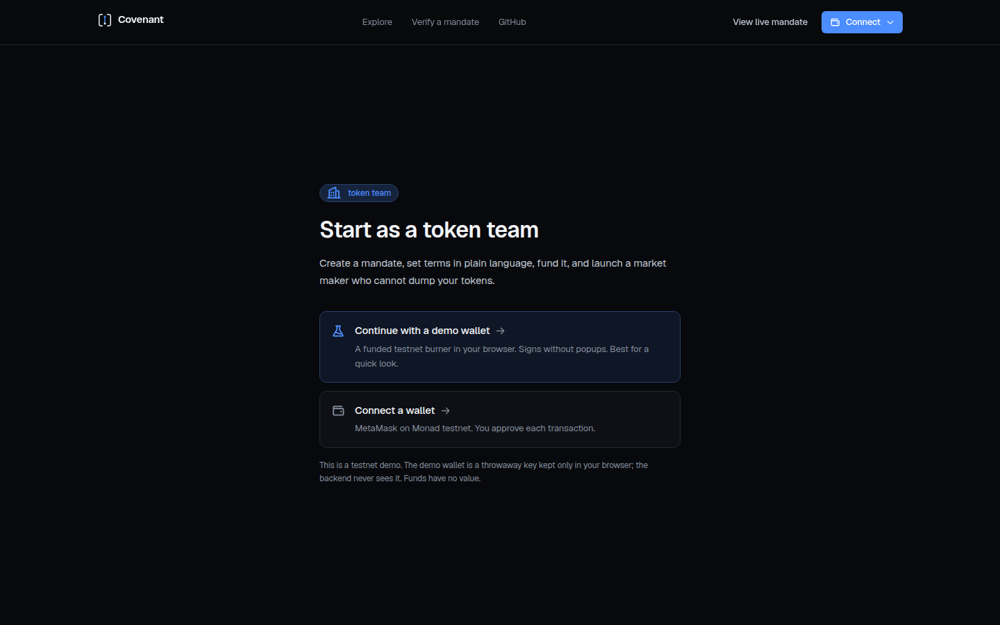

- **What you see:** a role-aware intro ("Start as a token team / market maker / trader") and two
  choices.
- **Buttons:**
  - **Continue with a demo wallet** → generates a throwaway burner key **in your browser** (the
    backend never sees it), then calls `POST /demo/session`. That one call: **drips 0.2 MON**
    (gas money), **mints 100k demo base + 100k USDC**, and — for the MM role — **creates a fresh
    mandate** inviting your burner as the MM. Then it routes you onward (issuer → `/create`, MM →
    `/invite/[vault]`, trader → `/proof/[vault]`).
  - **Connect a wallet** → MetaMask on Monad testnet; you approve each transaction yourself.
- **What can go wrong:** the faucet is rate-limited (1 fund per address, 5 per IP per 24h, and a
  daily MON budget). If it's exhausted you get a **friendly fallback panel** ("the demo faucet is
  at its daily cap") with "Explore the live flagship" — never a dead end. (Historically the MON
  drip could silently fail, leaving the burner with tokens but 0 MON; see Known limitations #1 —
  fixed by routing the drip through the treasury.)

From here the judge is an **issuer** (section 2), a **market maker** (section 3), or a **trader**
(section 4's proof page). The 3-minute script in section 5 is the recommended judge path.

---

# 2 · The issuer (create and run a mandate)

### 2.1 My mandates — `/app`

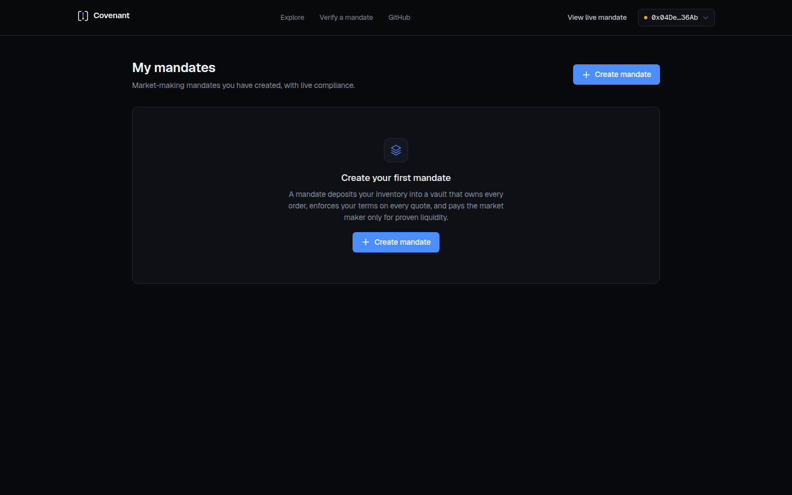

- **What you see:** every mandate you've created, each as a row with its state badge and a live
  net-sold / compliance strip. Empty, loading, not-connected, and error states all have their own
  panels.
- **Buttons:** **Create mandate** (top-right, and in the empty state) → `/create`. Clicking a row →
  that mandate's dashboard `/mandate/[vault]`. No chain writes here — it's a read of
  "mandates created by my address" from the indexer.
- **What can go wrong:** if you're not connected you get a "Connect to see your mandates" prompt. A
  brand-new mandate appears as soon as the indexer records its creation event (seconds, now that
  the indexer runs at the chain head).

### 2.2 Create wizard — `/create` (four steps)

**Step 1 — Token & market**

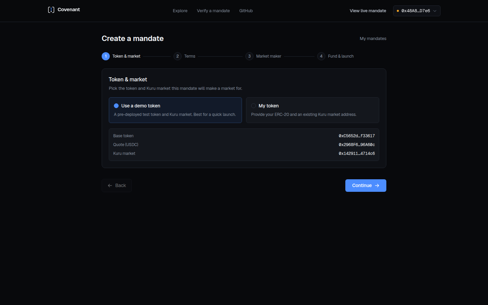

- **What you see:** choose **Use a demo token** (a pre-deployed test token + Kuru market, best for a
  quick launch) or **My token** (paste your ERC-20 + an existing Kuru market address).
- **Buttons:** the two choice cards (local selection, no chain). **Continue** advances; it's
  disabled until a valid market is chosen.

**Step 2 — Terms**

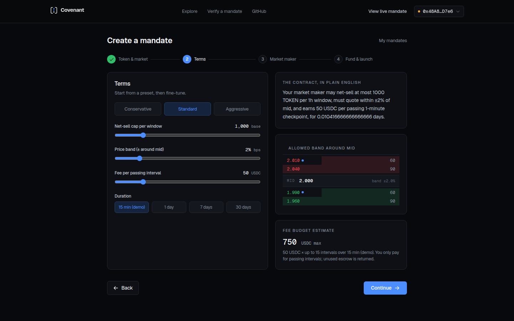

- **What you see:** three presets (**conservative / standard / aggressive**) and sliders for
  **net-sell cap per window**, **price band (± around mid)**, and **fee per passing interval**, plus
  a **duration** picker. A live **plain-English preview** of the contract ("Your MM may net-sell at
  most … must quote within ±…% of mid, and earns … USDC per passing interval"), a mini order-book
  showing the allowed band, and a **fee-budget estimate**.
- **Buttons:** presets and sliders only change the draft locally — nothing is on-chain yet. This is
  where the issuer decides the rails the MM will be physically held to.

**Step 3 — Market maker**

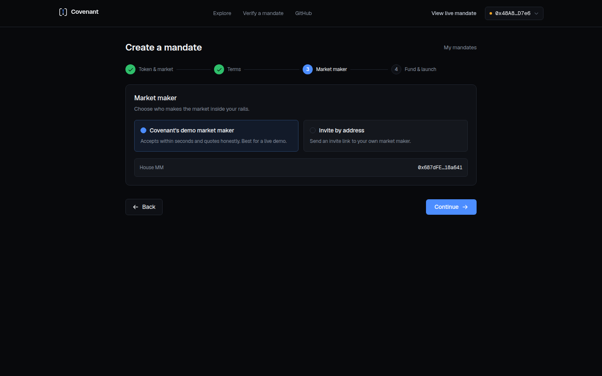

- **What you see:** **Covenant's demo market maker** (the house MM — accepts within seconds and
  quotes honestly, best for a live demo) or **Invite by address** (paste your own MM's address; an
  invite link `/invite/[vault]` is generated after launch).
- **Buttons:** choice cards + a copy button for the invite base URL. Still no chain write.

**Step 4 — Fund & launch**

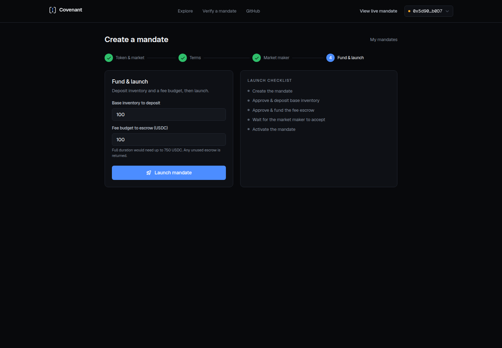

- **What you see:** inputs for **base inventory**, **quote inventory** (lets the MM place bids —
  two-sided quoting needs both), and **fee budget to escrow**, plus a launch checklist.
- **The Launch button** runs **six on-chain steps in order**, shown live with per-step latency:
  1. **Create the mandate** — `createMandate(terms)` on the factory → deploys your CovenantVault
     (emits `MandateCreated`).
  2. **Wait for the MM to accept** — polls until the mandate reaches ACCEPTED (the house MM
     auto-accepts in a few seconds). *The contract refuses deposits before ACCEPTED, so this wait
     is load-bearing.*
  3. **Approve & deposit base inventory** — `depositInventory(base, …)` into the vault's Kuru
     margin.
  4. **Approve & deposit quote inventory** — `depositInventory(quote, …)` so the MM can post bids.
  5. **Approve & fund the fee escrow** — `fundFees(quote, budget)`.
  6. **Activate the mandate** — `activate()` → state becomes ACTIVE; you're routed to the dashboard.
- **What can go wrong:** if the MM never accepts within 60s, step 2 times out (use the house MM for
  demos). If your wallet is short on demo tokens, the deposit steps fail — top up via the faucet.
  The wizard draft is saved in your browser, so a refresh mid-wizard doesn't lose your settings.

### 2.3 Mandate dashboard — `/mandate/[vault]` (the issuer's hero screen)

- **What you see, live:** a status bar (state badge, "Enforced by contract" link to the verified
  source, time left, MM address); a **flow strip** that pulses on real events; the **order book**
  with the vault's own orders marked and the allowed band shaded; a **net-sold gauge** (net of
  buybacks, resets every window); a **KPI timeline** (green paid / red failed / grey unobserved /
  striped paused per interval); a **fees** panel (escrow / accrued / claimed) that shows
  **"Frozen this interval"** when a failing observation has voided the current fee; and a live
  **activity feed**, each row linking to the explorer.
- **Buttons (issuer only):**
  - **Pause** → `pause()` (blocks new orders) / **Unpause** → `unpause()`.
  - **Terminate** → opens a confirm dialog, then runs **two transactions**: `terminate()` (→ ENDED)
    then `cancelAllAfterEnd()` (cancels every resting order). See the confirm dialog:

    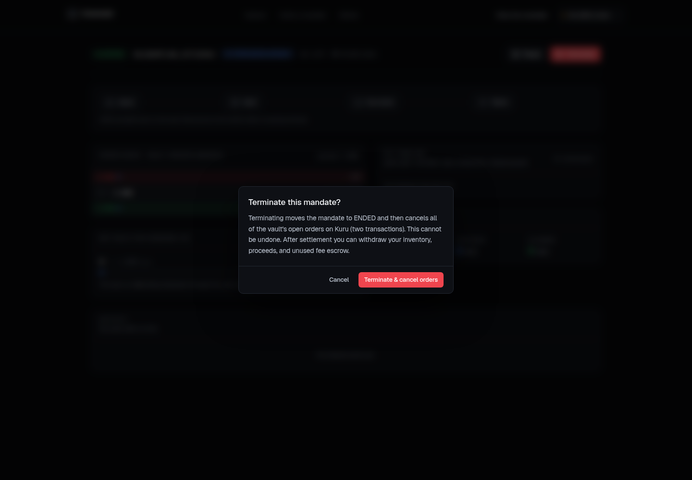
  - **Withdraw & settle** (only in ENDED, and only once 0 orders are open) → `withdraw()`, which
    returns **inventory + sale proceeds + unused fee escrow** to the issuer and moves the mandate to
    SETTLED. The button is disabled and reads "Cancel N orders first" while any order still rests.
- **The frozen-fee state looks like this** (a failing observation voided the interval's fee):

  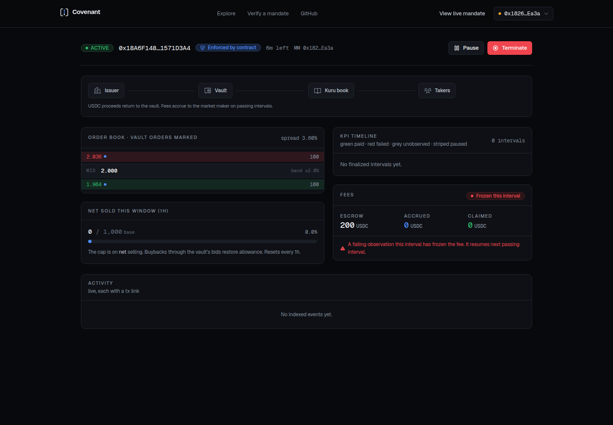
- **The settlement receipt** (shown once ENDED/SETTLED): "Returned to issuer" (base + USDC proceeds
  and unused escrow), intervals paid, MM earned, MM claimed.

  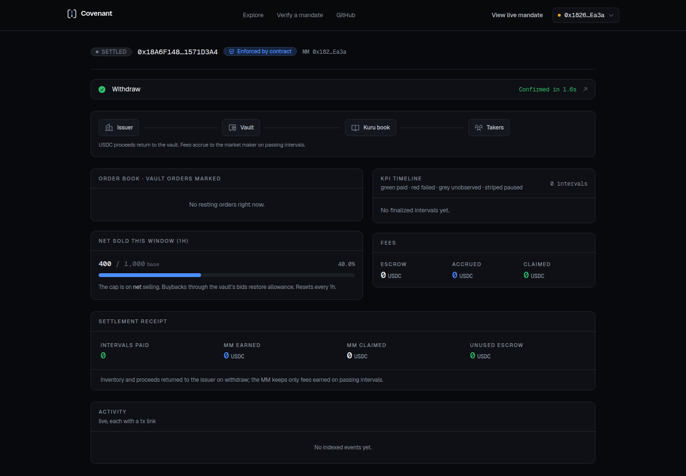
- **What can go wrong:** the Pause/Terminate/Withdraw controls only appear for the issuer wallet.
  Withdraw is gated on all orders being cancelled first (the two-step terminate handles that).
  Right after a withdraw the indexer hasn't yet recorded the `Withdrawn` events, so the receipt
  reads the **amounts captured the instant you clicked Withdraw** rather than the (now zero)
  post-withdraw balances — this was a real bug (Known limitations #3) and is now fixed.

---

# 3 · The market maker (quote inside rails you can't bend)

### 3.1 Invitation — `/invite/[vault]`

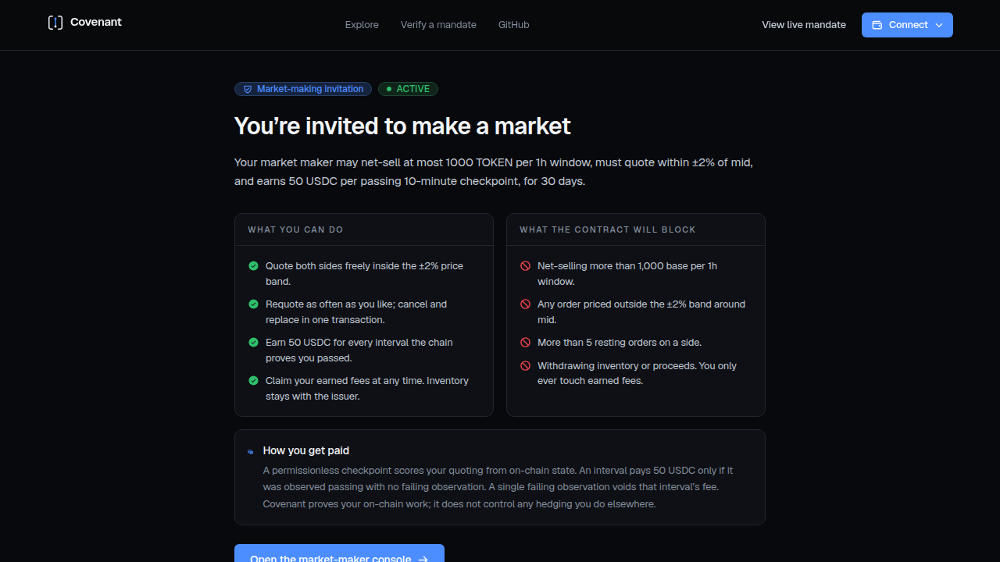

- **What you see:** the mandate in plain English, a side-by-side of **what you can do** (quote both
  sides freely inside the band, requote as often as you like, earn the fee for every interval the
  chain proves you passed, claim fees anytime — inventory stays with the issuer) and **what the
  contract will block** (net-selling past the cap, any order outside the band, too many resting
  orders per side, withdrawing inventory or proceeds). A "how you get paid" note explains the
  permissionless checkpoint and states plainly that Covenant doesn't control your off-venue hedging.
- **Buttons:** **Accept mandate** → `accept(vault, terms)`. This **pins the exact terms hash** you
  reviewed — if the issuer changes any term afterward, your acceptance is invalidated and you review
  again. On success you're taken to the console. If you've already accepted, the button becomes
  "Open the market-maker console".
- **What can go wrong:** you must connect a wallet first (link provided). The accept reverts if the
  terms were changed out from under you (that's the point — it protects you).

### 3.2 Console — `/mm/[vault]`

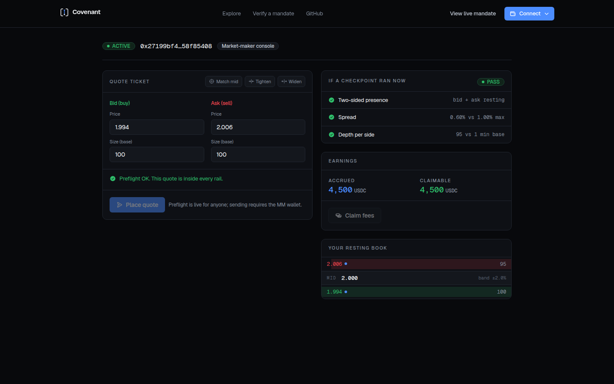

- **What you see:** a **quote ticket** (bid price/size, ask price/size) with **Match mid / Tighten /
  Widen** nudges; a **live preflight** line that re-computes the contract's governor + band +
  order-cap against live chain state and turns green ("inside every rail") or red with the exact
  reason — *before you pay*; an **"If a checkpoint ran now"** panel scoring two-sided presence,
  spread, and depth against the mandate's limits (PASS/FAIL); an **earnings** panel (accrued /
  claimable); and your **resting book**.
- **Buttons:**
  - **Place quote** → `quote(bids, sizes, asks, sizes, cancelIds)` — one governed Kuru batch update
    that cancels your old orders and places the new ones, **post-only**, running the sell-cap, band,
    and order-cap checks in the same transaction. Disabled unless you're the MM, the mandate is
    ACTIVE, and preflight is green.
  - **Send anyway** (only appears when preflight is red) → sends the same quote despite the warning.
    The contract rejects it and the UI shows the decoded **"Blocked by contract"** card. This is the
    wow moment — a *real mined, reverted transaction*, not a simulation:

    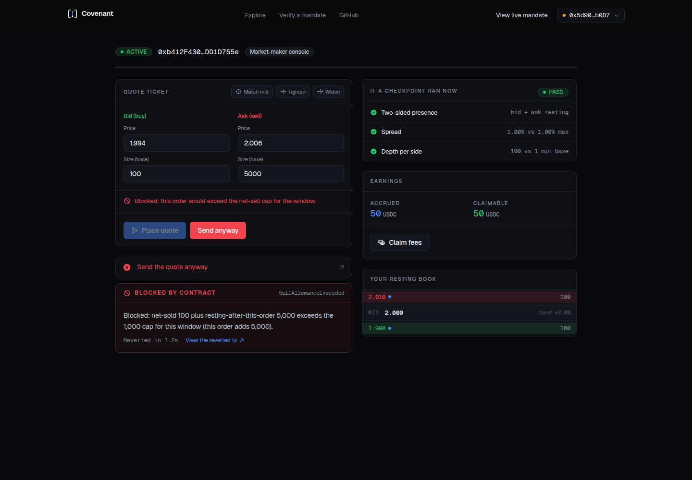
  - **Claim fees** → `claimFees()` pulls your earned fees to your wallet. Disabled when there's
    nothing claimable.
  - **Match mid / Tighten / Widen** just adjust the ticket numbers locally (no chain).
- **Here's what a red preflight looks like** before you send:

  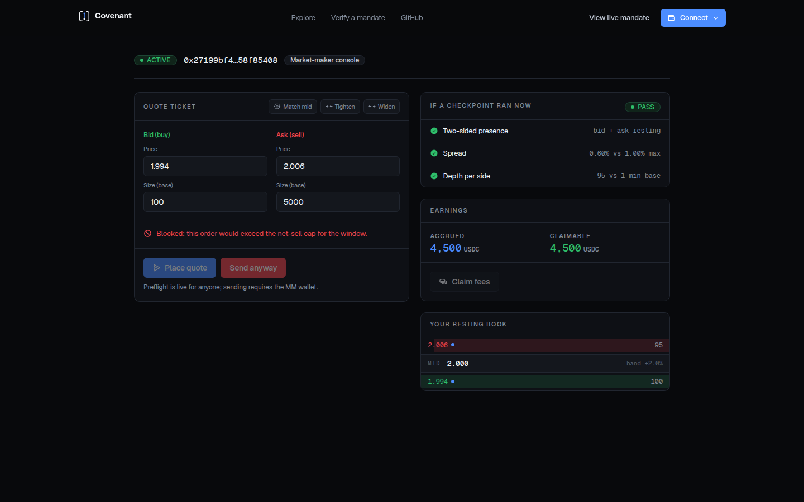
- **If you widen your spread past the KPI max, the checkpoint panel flips to FAIL** — and a real
  `checkpoint()` then records a failing observation that freezes the fee:

  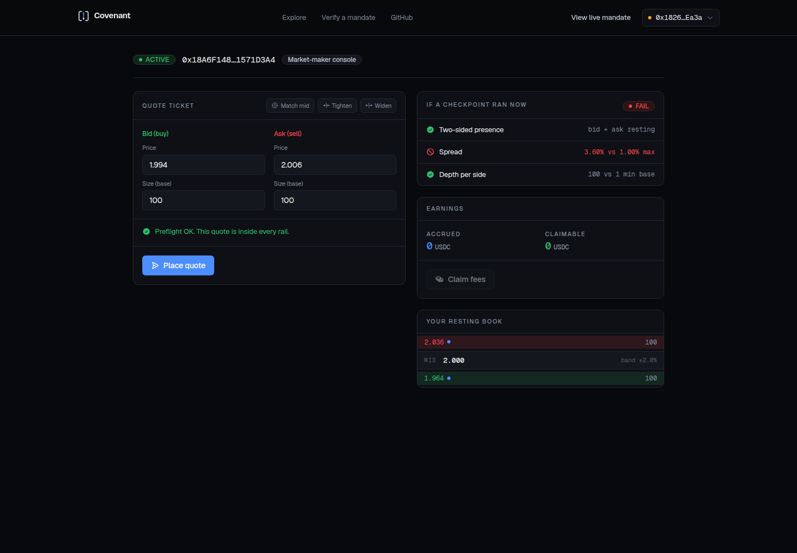
- **What can go wrong:** if you're not this mandate's MM, the console is **read-only** (preflight
  still works for anyone; sending requires the MM wallet). Quoting is disabled unless the mandate is
  ACTIVE. On a shared demo market a small taker buy may fill a competing seeder order first — quote
  with real size so your orders sit at the top of the book.

---

# 4 · The public (verify and trade, no wallet)

### 4.1 Explore — `/explore`

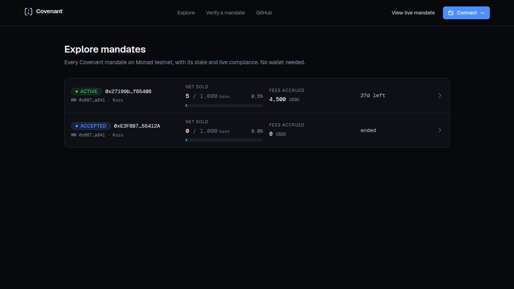

- **What you see:** every Covenant mandate on testnet with its state and live compliance. No wallet
  needed. Each row links to that mandate's **public proof page**.
- **Buttons:** rows → `/proof/[vault]`. Pure reads.

### 4.2 Public proof — `/proof/[vault]`

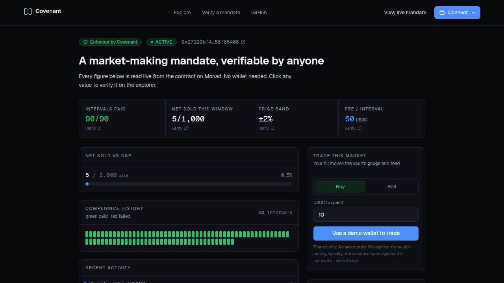

- **What you see, with no wallet:** a big "Enforced by Covenant" header and the live numbers —
  **intervals paid / total**, **net sold vs cap**, **price band**, **fee per interval** — each a
  link that **verifies on the explorer**. Below: the net-sold gauge, the compliance history
  timeline, a recent-activity feed, an embeddable badge, and a trade panel.
- **Buttons:**
  - **Trade panel — Buy base / Sell base** → `placeAndExecuteMarketBuy/Sell` on the Kuru market. A
    fill against the vault's resting order counts against the mandate's net-sell cap and moves the
    gauge within seconds. If you have no wallet, the panel shows **"Use a demo wallet to trade"**,
    which funds a burner first.
  - **Checkpoint it yourself — Checkpoint now** → `checkpoint()`. Checkpoints are **permissionless**:
    anyone can force the chain to score the MM right now (needs a wallet with a little MON). This is
    the anti-gaming property — the MM must be compliant continuously, not just on a predictable tick.
  - **Copy embed code / Copy share link** → clipboard only (an `` badge others can embed).
  - **The verify links** → open the vault/txs on `testnet.monadexplorer.com`.
- **A trader's buy landing in the gauge looks like this:**

  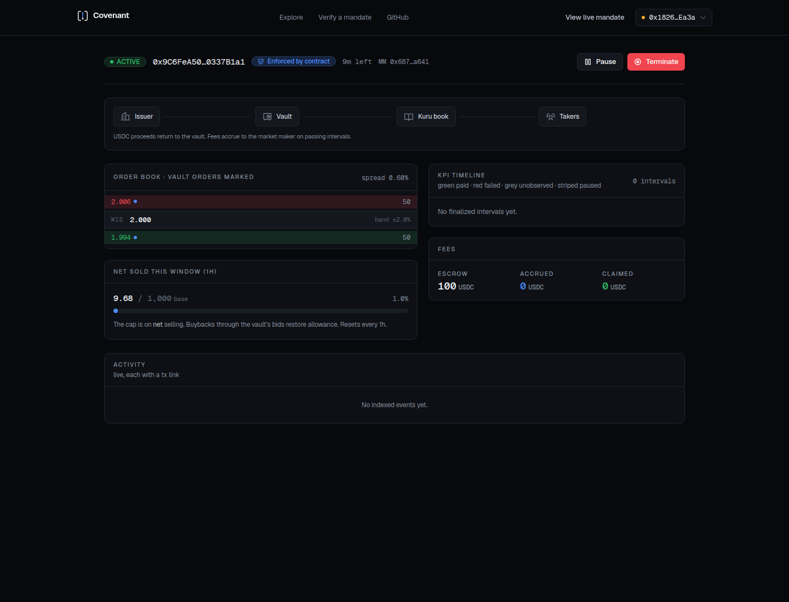
- **What can go wrong:** on the shared demo market, a *small* buy can fill a competing seeder order
  before it reaches the vault's ask; a larger buy reaches the vault. "Checkpoint now" needs a funded
  wallet (it's a real transaction).

---

# 5 · The 3-minute demo script (beat by beat, exact clicks)

> Recommended as the judge path. Times are a guide. Everything is real testnet; the house MM and
> keeper do their parts automatically.

| Time | Beat | Exact clicks | What the audience sees on-chain |
|---|---|---|---|
| **0:00** | The problem | Open **`/`** (landing). Point at the **66M** Movement card and the **"Blocked by contract"** revert card. | Nothing yet — set up the stakes. |
| **0:25** | Become an issuer, funded in one click | Click **I'm a token team** → on `/start`, click **Continue with a demo wallet**. | `POST /demo/session`: 0.2 MON drip + 100k base + 100k USDC minted to a browser burner. Routed to `/create`. |
| **0:45** | Create the mandate | Step 1: leave **Use a demo token** → **Continue**. Step 2: click **Standard**, show the plain-English preview → **Continue**. Step 3: leave **Covenant's demo market maker** → **Continue**. Step 4: leave the defaults → **Launch mandate**. | Six steps run live with latencies: `createMandate` → wait-for-accept (house MM accepts in seconds) → deposit base → deposit quote → fund fees → `activate`. Routed to the dashboard, ACTIVE. |
| **1:15** | The maker quotes inside the rails | Stay on **`/mandate/[vault]`**. Wait ~15–20s. | The house MM posts a **two-sided quote**; the order book fills with the vault's orders inside the shaded band, the flow strip pulses, the activity feed shows `OrderPlaced`. |
| **1:35** | A trader hits the book | Open the **`/proof/[vault]`** page (or the flagship `/proof`), type a size in the **trade panel**, click **Buy base**. | `placeAndExecuteMarketBuy` → a real `Trade`; back on the dashboard the **net-sold gauge jumps** and the feed shows the fill — confirmed in ~1s. |
| **2:00** | The wow moment — the contract refuses a dump | Go to the **`/mm/[vault]`** console (as the MM burner). Set the ask **size huge** (e.g. 5,000). Preflight turns **red**. Click **Send anyway**. | A **real mined, reverted** transaction → the **"Blocked by contract: SellAllowanceExceeded"** card with the exact arithmetic and an explorer link. |
| **2:20** | Pay only for proven work | In the console, click **Widen** so the spread exceeds the KPI max — the **"If a checkpoint ran now"** panel flips to **FAIL**. Then on `/proof`, click **Checkpoint now** (or let the keeper run). | A real `checkpoint()` records a **failing observation**; the dashboard fees panel shows **"Frozen this interval"** — no fee for that interval. |
| **2:40** | Anyone can verify | Open **`/proof/[vault]`**. Click any number's **verify** link. | The explorer opens on the real contract/tx — every claim is independently checkable, no wallet. |
| **2:55** | Settle | (Optional) On the dashboard click **Terminate** → confirm → **Withdraw & settle**. | `terminate` + `cancelAllAfterEnd` → ENDED; `withdraw` returns inventory + proceeds + unused escrow → SETTLED; the receipt matches the chain. |

**One-line pitch to close:** *the tokens sit in a contract that is the only thing allowed to place
orders, and it refuses any order that breaks the mandate — so the maker works inside rails it
cannot bend, and only gets paid for liquidity the chain can prove.*

---

# 6 · Known limitations

1. **Faucet MON drip (fixed in code; needs the Railway redeploy to go live).** The original drip
   sent the 0.2 MON from the faucet wallet as a third transaction right after its two token-mint
   transactions. All three were in flight on the same nonce queue, and under Monad's
   reserve/balance accounting the combined value+gas reservations tripped the reserve floor, so the
   transfer **reverted while consuming its full gas limit** — yet an isolated replay of the same
   transfer succeeds, which is why it was so hard to pin. Worse, the old drip was fire-and-forget
   (the receipt was never checked), so `/demo/session` returned "ok" while the burner ended with
   **tokens but 0 MON** and couldn't pay for any transaction. **Fix:** route the drip through the
   **treasury** — a dedicated, well-funded wallet that sends a single transfer with no concurrent
   mints — and await its receipt (verified: treasury drip succeeds with status success; the old
   faucet-wallet drip reverts). This fix is committed to the working tree but must be redeployed to
   Railway to take effect for live judges.
2. **Indexer cold-start on a fresh deploy.** The activity feed and KPI timeline read from the
   indexer, which backfills Kuru's order-book events from the factory deploy block. The RPC caps
   `eth_getLogs` at 100 blocks, so a full backfill of ~1.6M blocks is RPC-bound and slow; the
   backfill is now parallel/chunked with rate-limit backoff, and there's a one-deploy escape hatch
   to jump the cursor near the head. On the current deployment the indexer sits at the chain head
   (a few blocks of lag), so new mandates populate within seconds — but a brand-new deploy with no
   persistent volume starts cold again.
3. **Settlement-receipt and net-sold display (fixed).** Immediately after a withdraw, the indexer
   hasn't recorded the `Withdrawn` events yet, and the vault's `soldBase` figure becomes an artifact
   once inventory is withdrawn. The dashboard previously showed post-withdraw zeros and a wrong
   net-sold on SETTLED mandates. It now captures the returned amounts the instant you click Withdraw
   (falling back to the withdraw events), and shows the real final net-sold.
4. **Shared demo market fills.** All demo mandates share one Kuru market with a seeder that keeps a
   live mid. A small taker buy can fill the seeder before the vault's ask; a larger buy reaches the
   vault. Fine for a demo, confusing if you buy tiny.
5. **Contracts are the research spike's lifecycle, on testnet.** The custody/ownership/governor/band
   enforcement is proven by tests and recorded testnet transactions; the full multi-state lifecycle,
   fee escrow, and KPI scoring are product additions on top. This is a testnet product with mock
   tokens (open mint); mainnet would use real USDC and a Kuru-provisioned market.
6. **Wallet UX is deliberately minimal.** The app uses an injected wallet (MetaMask) or an
   in-browser burner — there's no WalletConnect/RainbowKit (no project id), so no mobile-wallet
   deep-linking.

---

# 7 · What I'd improve with more time

1. **Make the faucet/treasury self-healing and observable.** The drip fix is in; next I'd add a
   `/health` history + a small alert when the treasury's 24h spend approaches its cap, and give the
   treasury's NonceManager an explicit "reset from chain and retry" so an out-of-band CLI send can
   never surface even one failed request.
2. **A persistent indexer with a checkpointed cursor + a backfill progress endpoint**, so a fresh
   deploy is never cold and the UI can show "catching up, 94%" instead of an empty feed.
3. **An MM auto-quoter in the browser** (requote on price moves, not every block) so a judge can
   watch the book stay tight and checkpoints pass without hand-quoting.
4. **Richer proof:** a shareable, signed compliance report per mandate (intervals passed, net-sold
   history, every checkpoint tx) and a real embeddable badge image service.
5. **Buyback-aware net-sell accounting with an explicit accumulator** and a tumbling-window reset,
   tested against two-sided fills, rather than inferring net-sold from the margin delta.
6. **Trade panel polish:** show the expected fill vs the vault's ask, warn when a buy is too small
   to reach the vault, and surface the maker rebate.
7. **Mobile wallet support** (WalletConnect) and a trimmed mobile proof page for sharing.
8. **End-to-end tests in CI** that run the five journeys against a forked testnet on every push, so
   regressions in the wizard order or the settlement math are caught before deploy.
